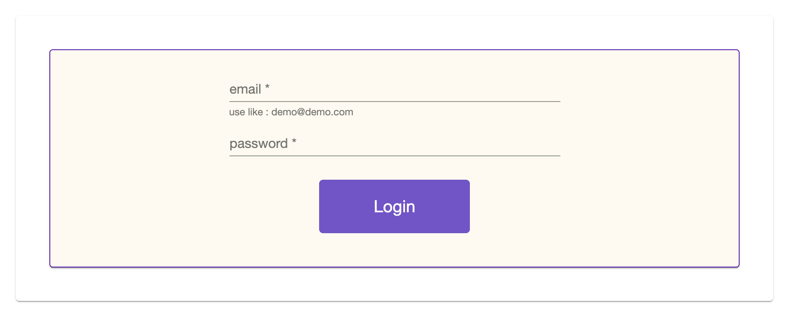
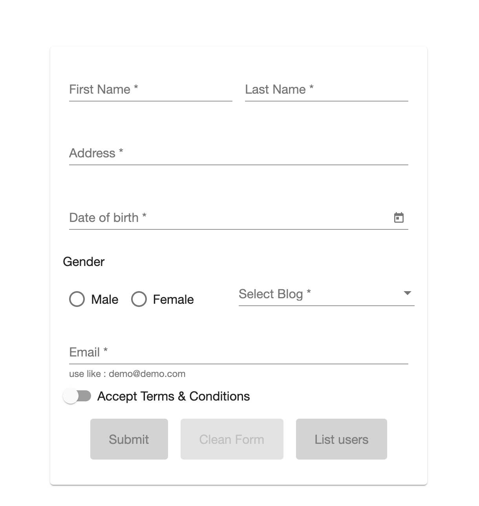
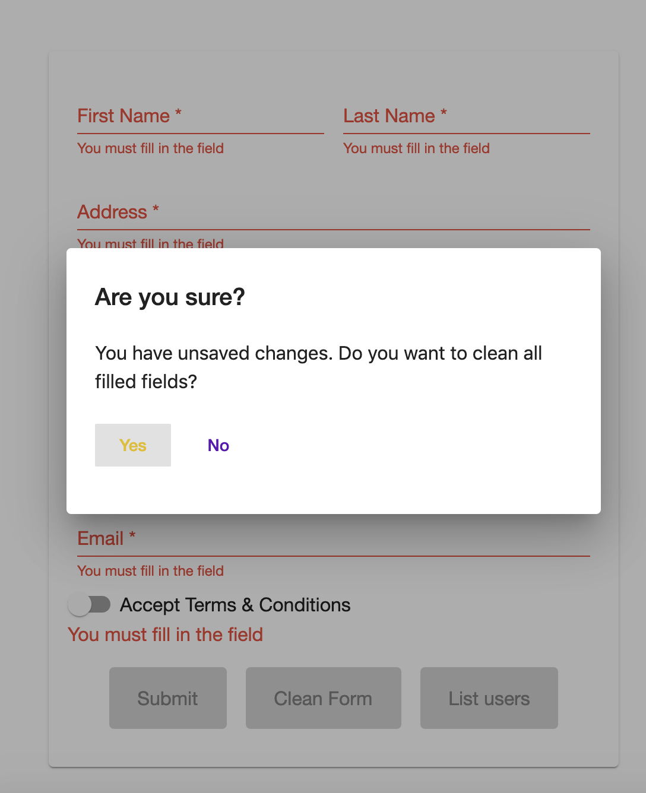
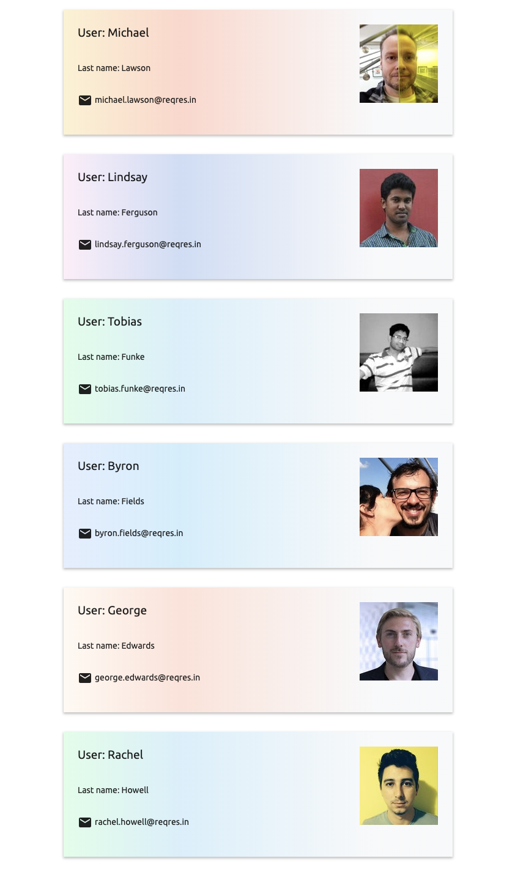
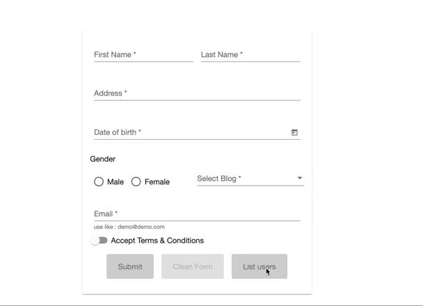

# Forms

## Description
This application demonstrates the work of Angular using internal routing. 
The first route loads the login form. In the form, the validity of the fields
is checked, an id is assigned to the user after correct filling the form. 
If the id is in Local Storage, the user will be able to go through all the 
routes except the login form. If there is no id, the user is not able to open 
any route except the login form. This functionality is implemented by the 
guards of Angular. When the user fills the login form, a form for filling 
personal data opens. The validity of all fields is checked for completion and 
in accordance with other rules established by the component. There is also a 
check of fields with custom validators, validators - the prohibition of a 
specific email (demo@demo.com) and the prohibition of entering characters and 
numbers in the fields name and surname. This form has 3 “Submit” buttons - for 
sending, a “Clear form” button for cleaning the form (implemented through a 
dialog box) and “List users” for moving to the next route. When moving, a mode 
is loaded using lazy loading. After the button with animation is presented, 
which redirects to the list of users. The data comes in an HTTP request for a 
test REST API. An id is attached using an HTTP request using an Angular 
interceptor. The list of users is displayed using Angular Material with the 
addition of animation. To style the application, I used SCSS. The following 
libraries were used in the project: Angular 8.3.0, RxJS 6.4.0, Bootstrap 4.3.1, 
Angular Material 8.2.1.

This project was generated with [Angular CLI](https://github.com/angular/angular-cli) version 8.3.0.

## Development server

Run `ng serve` for a dev server. Navigate to `http://localhost:4200/`. The app will automatically reload if you change any of the source files.

## Code scaffolding

Run `ng generate component component-name` to generate a new component. You can also use `ng generate directive|pipe|service|class|guard|interface|enum|module`.

## Build

Run `ng build` to build the project. The build artifacts will be stored in the `dist/` directory. Use the `--prod` flag for a production build.

## Running unit tests

Run `ng test` to execute the unit tests via [Karma](https://karma-runner.github.io).

## Running end-to-end tests

Run `ng e2e` to execute the end-to-end tests via [Protractor](http://www.protractortest.org/).

## Further help

To get more help on the Angular CLI use `ng help` or go check out the [Angular CLI README](https://github.com/angular/angular-cli/blob/master/README.md).
